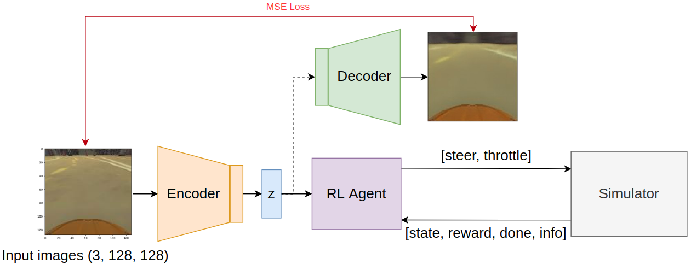
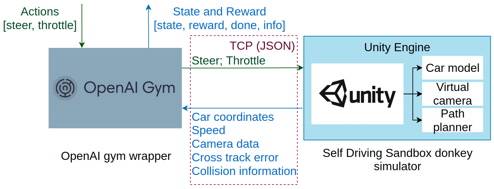
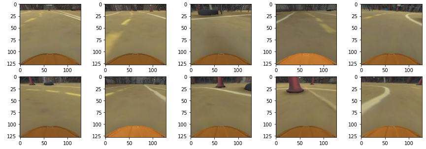

# Auto features extraction for RL

Features Extraction using Autoencoders and Contrastive Learning for Reinforcement Learning Tasks

### Project architecture



### Simulation environment architecture



### Data samples



### Code tree:
````
.
├── framework
│   ├── aux.py
│   ├── CustomModels.py
│   ├── data.py
│   ├── loss.py
│   ├── models.py
│   ├── Run.ipynb
│   ├── scheme.png
│   └── train.py
├── images
│   ├── data_samples.png
│   ├── project_architecture.png
│   └── simulator_architecture.png
├── LICENSE
├── logs
│   ├── log_AdversarialAE@03.06.2020-17:09:56.csv
│   ├── log_BetaVAE@03.06.2020-17:14:45.csv
│   ├── log_CLR18.csv
│   ├── log_JigsawVAE@06.06.2020-16:38:07.csv
│   ├── log_NormalizingFlowVarianceConstrainedAE@07.06.2020-14:50:08.csv
│   ├── log_VanillaVAE@03.06.2020-17:11:32.csv
│   ├── log_VarianceConstrainedAE@07.06.2020-09:31:07.csv
│   └── log_WassersteinAE@03.06.2020-17:12:47.csv
├── LR_plots.ipynb
├── README.md
├── run.py
├── saved_model
│   ├── AdversarialAE.best.pth
│   ├── BetaVAE.best.pth
│   ├── JigsawVAE.best.pth
│   ├── NormalizingFlowVarianceConstrainedAE.best.pth
│   ├── VanillaVAE.best.pth
│   ├── VarianceConstrainedAE.best.pth
│   └── WassersteinAE.best.pth
├── src
│   ├── args.py
│   ├── features_extraction
│   │   ├── aae
│   │   │   ├── __init__.py
│   │   │   ├── model.py
│   │   ├── base.py
│   │   ├── beta_vae
│   │   │   ├── __init__.py
│   │   │   └── model.py
│   │   ├── __init__.py
│   │   ├── jigsaw_vae
│   │   │   ├── __init__.py
│   │   │   └── model.py
│   │   ├── networks.py
│   │   ├── vanilla_vae
│   │   │   ├── __init__.py
│   │   │   └── model.py
│   │   ├── variance_constrained_ae
│   │   │   ├── __init__.py
│   │   │   ├── model.py
│   │   │   └── normalizing_flows.py
│   │   └── wasserstein_ae
│   │       ├── __init__.py
│   │       └── model.py
│   ├── __init__.py
│   ├── reinforcement_learning
│   │   ├── base
│   │   │   ├── __init__.py
│   │   │   └── rl_agent.py
│   │   ├── client_secrets.json
│   │   ├── credentials.json
│   │   ├── ddpg
│   │   │   ├── ddpg_agent.py
│   │   │   ├── ddpg_nn_models.py
│   │   │   ├── __init__.py
│   │   │   ├── ou_noise.py
│   │   │   └── test_ddpg.py
│   │   ├── ddqn
│   │   │   ├── ddqn_agent.py
│   │   │   ├── ddqn_nn_models.py
│   │   │   ├── __init__.py
│   │   │   ├── README.md
│   │   │   └── test_ddqn.py
│   │   ├── env
│   │   │   ├── data_samples
│   │   │   │   ├── core_environments
│   │   │   │   └── custom_environments
│   │   │   ├── gym_core_environments
│   │   │   │   ├── atari_env.py
│   │   │   │   ├── car_racing_advanced
│   │   │   │   ├── car_racing.py
│   │   │   │   ├── __init__.py
│   │   │   ├── __init__.py
│   │   │   ├── launch_scripts
│   │   │   │   ├── __init__.py
│   │   │   │   ├── test_launch_car_racing.py
│   │   │   │   ├── test_launch_donkeycar.py
│   │   │   │   ├── test_launch_duckietown.py
│   │   │   │   └── unitylog.txt
│   │   │   ├── README.md
│   │   │   ├── test_donkey.py
│   │   │   ├── third_party_environments
│   │   │   │   ├── gym-donkeycar
│   │   │   │   ├── gym-duckietown
│   │   │   │   ├── __init__.py
│   │   │   │   └── sdsandbox
│   │   │   └── wrappers
│   │   │       ├── donkey_wrapper.py
│   │   │       ├── __init__.py
│   │   ├── __init__.py
│   │   ├── sac
│   │   │   ├── __init__.py
│   │   │   ├── sac_agent.py
│   │   │   ├── sac_nn_models.py
│   │   │   └── test_sac.py
│   │   ├── scenario
│   │   │   ├── __init__.py
│   │   │   ├── progress
│   │   │   │   ├── console_progress_reporter.py
│   │   │   │   ├── __init__.py
│   │   │   │   ├── neptune_progress_reporter.py
│   │   │   │   ├── progress_reporter.py
│   │   │   ├── rl_train_scenario.py
│   │   │   └── teleop
│   │   │       ├── __init__.py
│   │   │       └── teleop.py
│   │   ├── settings.yaml
│   │   ├── unitylog.txt
│   │   └── utils
│   │       ├── __init__.py
│   │       ├── nn_layers.py
│   │       ├── nn_utils.py
│   │       └── replay_buffer.py
│   ├── test_modules.py
│   ├── train_agent.py
│   ├── unitylog.txt
│   └── utils.py
├── train_aae.py
├── train_beta_vae.py
├── train_jigsaw_vae.py
├── train_vanilla_vae.py
├── train_vcae.py
├── train_wasserstein_ae.py
└── tutorial_for_feature_extraction.ipynb

````
